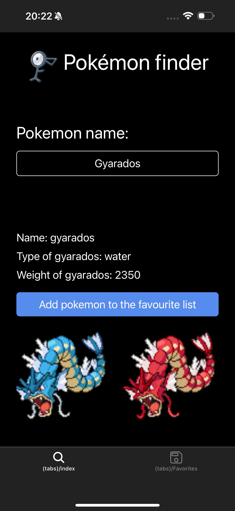
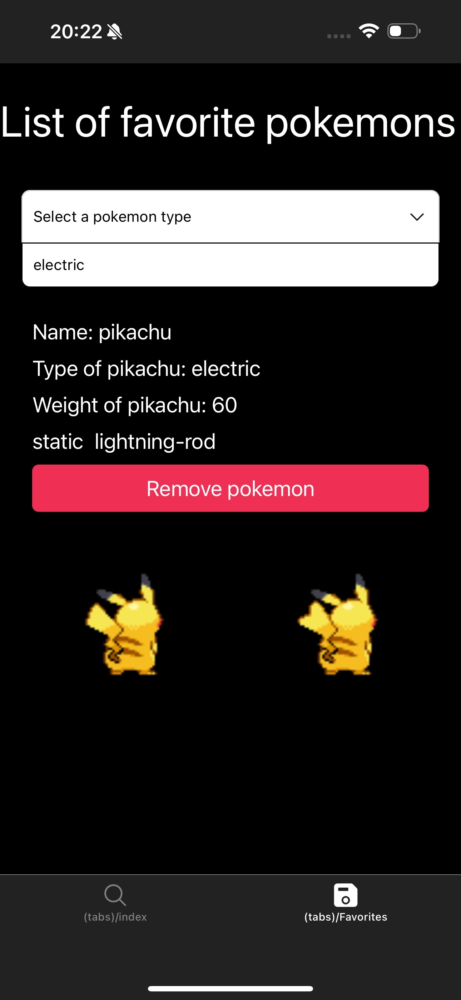

# Nombre del Proyecto

Proyecto sencillo en react native con expo en el cual se hace
   - LLamada a una API
   - Componetización de la APP
   - Uso de hooks
      - useContext y createContext
      - reducers 
      - useEffect
      - etc...

## Objetivo:

Crear una app para que el usuario pueda buscar pokemon y tener una lista de favoritos (temporal)
---

##  Tecnologías usadas
- [Expo](https://expo.dev/)
- [React Native](https://reactnative.dev/)
- [TypeScript](https://www.typescriptlang.org/)

---

## ⚙️ Instalación y ejecución

### 1. Clonar el repositorio
```bash
git clone https://github.com/tuusuario/tu-proyecto.git
cd tu-proyecto
```
2. Instalar dependencias
```bash
npm install
```

o
```bash
yarn install
```

3. Ejecutar en Expo

```bash
npx expo start
```

📱 Para probar en móvil: instalar la app Expo Go (Android/iOS) y escanear el QR.

💻 Para emulador: usar Android Studio o Xcode.

📂 Estructura del proyecto

```bash
app/
 ├─ (tabs)/
 │   ├─ index.tsx     # Pantalla principal
 │   ├─ Favorites.tsx # Pantalla de favoritos
 ├─ _layout.tsx   # Navegación de pestañas
 ├─ context/
 ├    ├─ pokemon.tsx # contexto entre las paginas
 ├─ reducers/
 ├    ├─  useListFavorites # states de la app
 ├─ services/
 ├   ├─ usePokemon.ts # hook para el fetching de datos
 ├─ types.d.ts # archivo de tipos
 assets/              # Imágenes, iconos, etc.
 components/
   ├─ Filter.tsx # c. para el dropdown picker
   ├─ NavBar.tsx #  c. para la la barra de navegación
   ├─ NotFound.tsx # c. para cuando la API no devuelve nada
   ├─ Pokemon.tsx # c. para cuando la API devuelve datos
   ├─ PokemonSearch.tsx # c. del buscador
 package.json
 README.md
```

🖼️ Capturas del proyecto:



